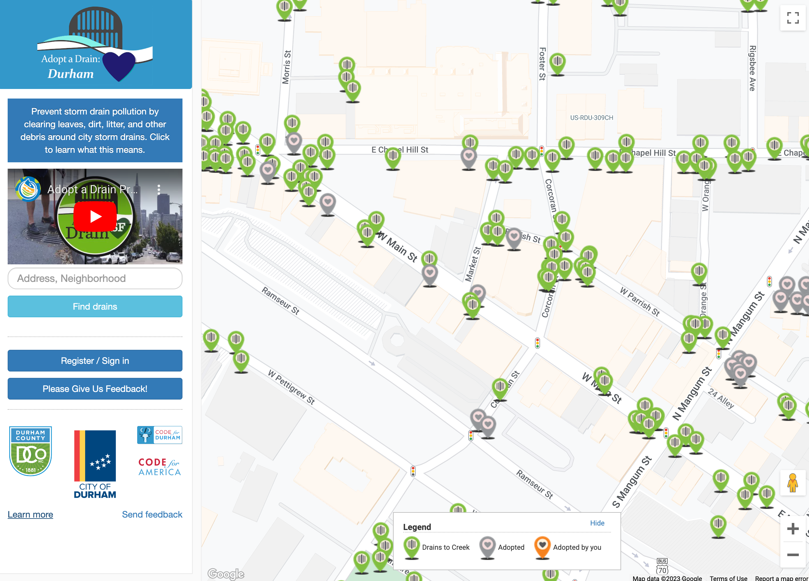

The Adopt a Drain Durham program enables Durham residents to "adopt" one of the
city's storm drains or catch basins and pledge to keep it free of leaves, dirt,
litter, and other debris. The program helps reduce localized flooding and
fosters community engagement by encouraging the public to take an active role in
improving their neighborhood.

Code with Durham and other volunteers used a web-based platform called
[GitHub](https://github.com/codefordurham/adopt-a-drain) to develop the open
source web application on Ruby on Rails. Github enabled contributors to work on
the project from anywhere in the world. They modeled Adopt a Drain Durham on
Boston's Adopt a Hydrant, for which Code for America provided initial
development support in 2012.

* **Website:** http://www.draindurham.org/
* **GitHub:** https://github.com/codefordurham/adopt-a-drain
