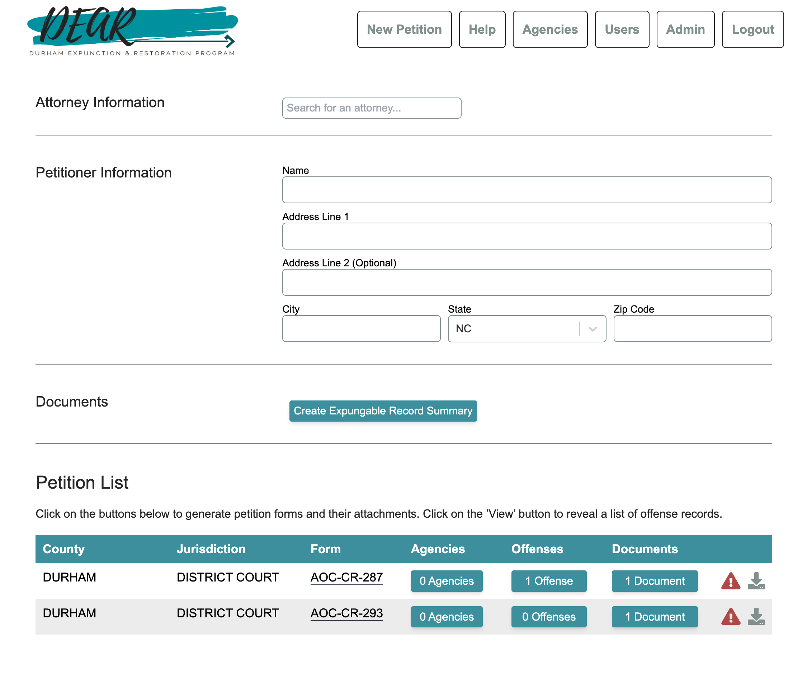

## Summary

In partnership with the [Durham Expunction and Restoration Project
(DEAR)](https://www.deardurham.org/), the Code with Durham team developed a tool
that takes data from an individual’s criminal record and automatically populates
the correct petition forms for expunction. This tool reduces a lengthy manual
data-entry process down to a few clicks, reducing human error and allowing
attorneys to serve more people. Access to record expunction is an important
equity issue, and this tool allows Durham to scale these services much faster.

* GitHub: https://github.com/deardurham

## Screenshot

