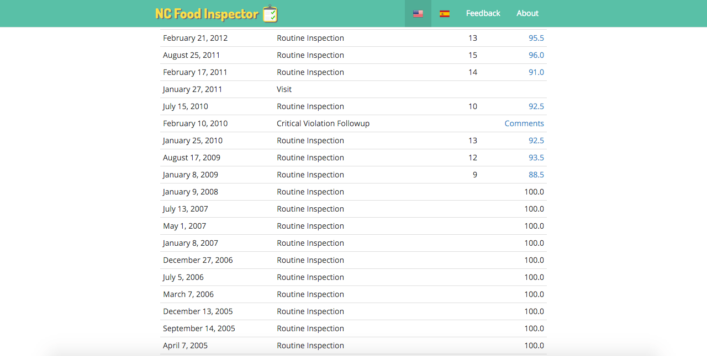

NCFoodInspector.com was a web application that let Durham County visitors know
the cleanliness of nearby restaurants. It displays a map and listing of
restaurants, their sanitation score, and details of any violations. This makes
difficult to access health inspection information readily available for the
first time. To ensure the app reached multiple populations, it was also available
in Spanish.

* **GitHub:** https://github.com/codefordurham/adopt-a-drain
